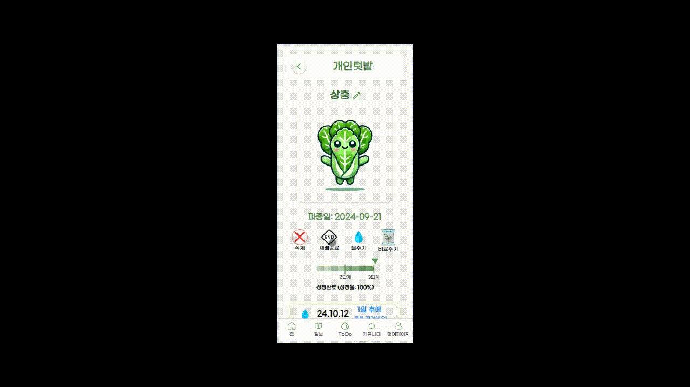
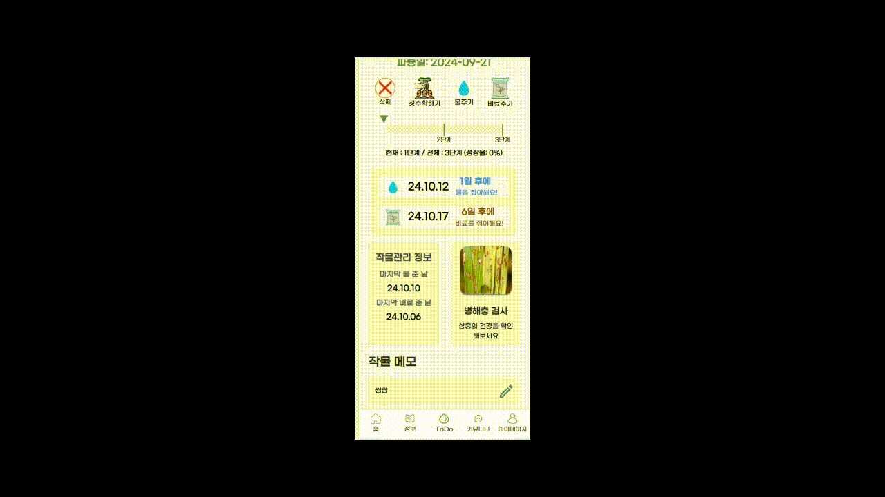
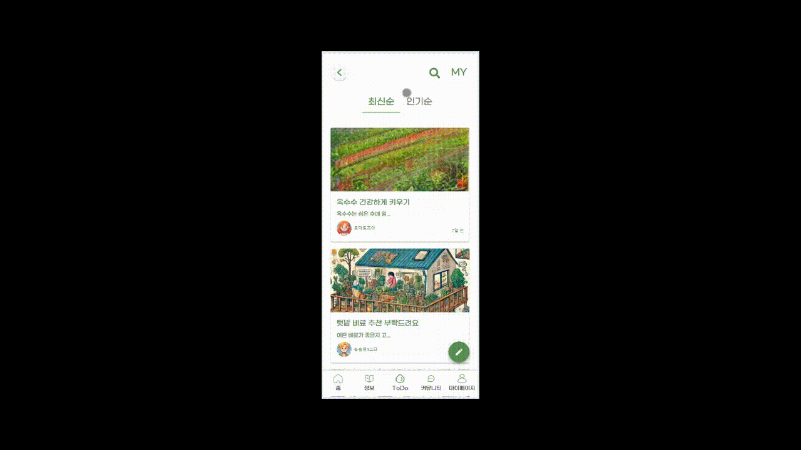
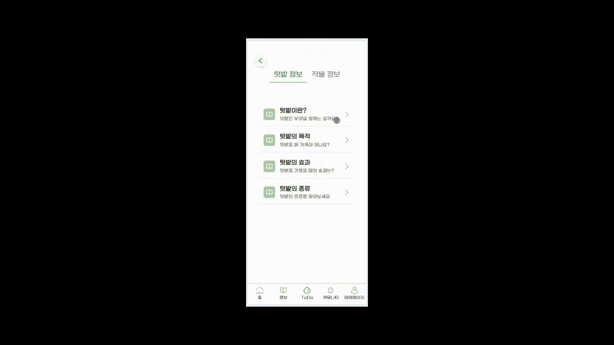
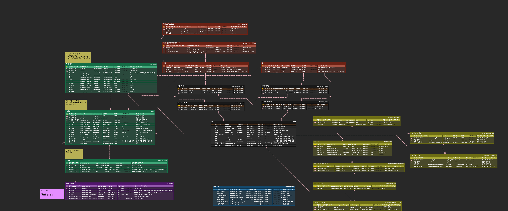

# 구미2반_D207
 - FE: 강동완, 김도환, 최다희
 - BE: 김태연, 하재훈
 - BIGDATA: 김호경(팀장), 윤민재

## 1. 서비스명 : 새싹농부

## 2. 서비스 개요
 - 베란다, 주말농장 등 주변에서 작물을 간단하게 키우고 싶은 도시농부들이 텃밭과 작물을 추천받고, 키우는 작물을 관리할 수 있는 서비스

## 3. 서비스 기능 및 페이지

 ### 1) 메인페이지
  - (로그인 전) 랜딩 페이지 제공
  

  - (로그인 후) 사용자 맞춤형 메인페이지 제공
  

 ### 2) 텃밭/작물 추천 및 등록
  - 원하는 텃밭을 선택하면 그 텃밭에 맞는 작물 추천
  - 원하는 작물을 선택하면 그 작물에 맞는 텃밭 추천
  - 텃밭/작물 선택 후 등록
 

 ### 3) 내 작물 관리
  - 내 작물 상세 페이지
 

  - 작물 history, TODO 페이지
 

 ### 4) 병해충 검사
  - AI 이미지 분석으로 작물 병해충 검사
 

 ### 5) 태그 기반 커뮤니티
  - 태그 기반 커뮤니티
 

 ### 6) 각종 정보 조회
  - 각종 정보 페이지
 

## 4. ERD

