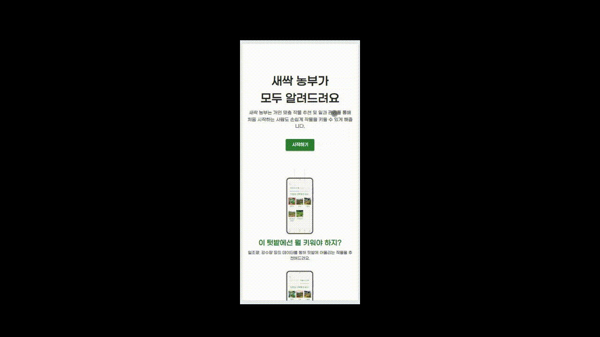
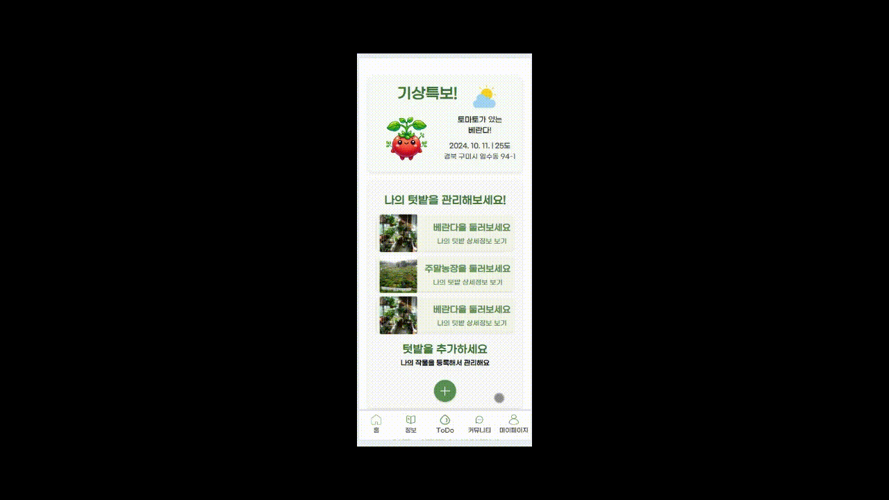

# 👨‍🌾 사용자 맞춤 농사 가이드 서비스 '새싹농부'

## ✅ 카테고리
| Application        | Domain              | Language      | Framework                 |
| -----------------  | ------------------  | ------------- | ------------------------- |
| ✅ Mobile Web     | ✅ AI               | ✅ JavaScript | ✅ React                 |
| ✅ Android App    | ✅ Big Data         | ✅ TypeScript | ✅ Node.js               |
| ✅ Desktop App    |                      | ✅ Python     | ✅ Spring/Springboot     |
|                   |                      | ✅ Java       | ✅ MUI(Material UI)      |
|                   |                      | ✅ FastAPI    |                           |
|                    |                     | ✅ SQL        |                           |
-----------------------------------------------------------------------------------------

## 🌱서비스 개요

### 서비스 설명   
-  베란다, 주말농장 등 주변에서 작물을 간단하게 키우고 싶은 도시농부들이 텃밭과 작물을 추천받고, 키우는 작물을 관리할 수 있는 맞춤형 서비스

### 기획 목적   
- 도시농업 참여자 23년 기준 약 170만명으로, 14년 70만명 대비 약 2.4배 상승했음에도 효율적인 맞춤형 텃밭 & 작물 추천 및 관리 서비스의 부재
- 처음 농사를 시작하는 사람들의 진입장벽을 낮추기 위해 '새싹농부' 서비스 기획    
- '새싹농부'는 도시농부를 위한 빅데이터 기반 맞춤형 서비스를 제공
- 해당 서비스는 도시인들에게 건강한 라이프 사이클을 제공하고, 도시농업 인프라 확장에 도움이 될것으로 기대

### 주요 기능   
- 사용자 맞춤형 개인화된 메인페이지   
- 빅데이터 추천 알고리즘 기반 작물/텃밭 추천   
- 빅데이터 알고리즘 기반 맞춤형 작물 관리 서비스   
- AI 이미지 분석 기반 작물 병해충 검사   
- 농부들을 위한 정보 공유 커뮤니티 (태그 기반 맞춤형 게시글 추천)

## 🌱 프로젝트 소개

**프로젝트 기간:** 2024.08.19 ~ 2024.10.11 (7주)

| 강동완 | 김도환 | 최다희 | 김태연 | 하재훈 | 김호경 | 윤민재|
| --- | --- | --- | --- | --- | --- | --- |
| Front-End | Front-End | Front-End | Back-End | Back-End | Big Data | Big Data|

## 🌱 서비스 기능 및 화면

 ### 랜딩페이지   
  -  로그인하지 않은 사용자에게 본 서비스에 로그인하여 이용해볼 수 있도록 랜딩페이지 제공
  

 
 ### 메인페이지
 #### 로그인 후 사용자 정보를 바탕으로 개인별 맞춤형 메인페이지 제공
  - 키우고 있는 작물의 TODO 정보 및 추천 정보 제공
  - 계절, 날씨, 사용자 지역, 나이 등 데이터 기반 추천 작물 제공
  - 선호 작물/텃밭 기반 추천 정보 제공
  - 선호 커뮤니티 태그 기반 게시글 제공
  - 사용자 지역 기반 주말농장 추천
  

 ### 텃밭/작물 추천 및 등록
  - 원하는 텃밭을 선택하면 그 텃밭에 맞는 작물 추천
  - 원하는 작물을 선택하면 그 작물에 맞는 텃밭 추천
  - 텃밭/작물 선택 후 등록
 

 ### 3) 내 작물 관리
  #### 내 작물 상세 페이지
   - 작물 정보 조회 및 관리(생장 정도, 이름, 메모 변경)
   - 작물 관리(물주기, 비료주기, 첫수확, 종료, 삭제)
   - 병해충 검사
 

  #### 작물 history, TODO 페이지
   - 키우기 종료한 작물 조회
   - 키우고 있는 작물들의 TODO 정보 조회
 

 ### 4) 병해충 검사
  - AI 이미지 분석을 기반으로 한 작물 병해충 검사
 

 ### 5) 태그 기반 커뮤니티
  #### 태그 기반 커뮤니티
   - 태그를 기반으로 검색하고, 조회하고, 등록하여 본인이 원하는 게시글만 골라볼 수 있는 도시농업 커뮤니티
 

 ### 6) 각종 정보 조회
  #### 각종 정보 페이지
   - 각 텃밭, 작물, 비료, 병해충 등에 대한 자세한 정보 제공
 

## 🛠️ 기술 스택
 ### 1) BE: Java, Spring Boot, JPA, mysql, mongoDB, redis
 ### 2) FE: React, Typescript, Axios, Material UI, react-rdux, react-router-dom
 ### 3) DATA: Python, FastAPI, SQLAlchemy
 ### 4) Colaboration: git, gitlab, notion, figma, jira

## 📝 ERD

## 🖍️ MockUp
[Figma URL](https://www.figma.com/design/33EeT0FspJR31S814mO0wM/SaeSSak?node-id=29-109&node-type=canvas&t=ZrNahah62sMMp6Mc-0)

## 📝 API 명세서
[API 명세서](https://www.notion.so/0abeddf5ac8740e6aa509f514585e8e9?v=efbe5a2b129445a0a2ae5b512a760b67&pvs=4)
